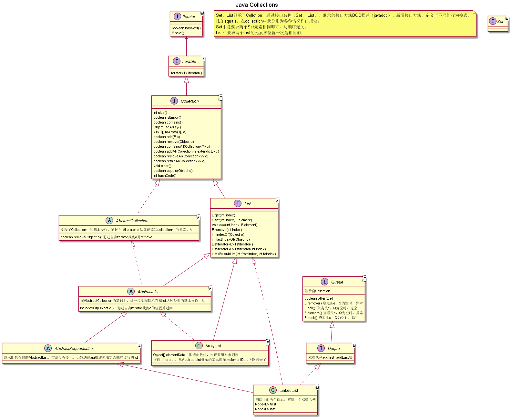

# Java Collections 框架

Java Collections库是java1.5 加入泛型之后，新增的数据结构库。类图如下：

 

这个库的作者之一Joshua Bloch写了Effective Java一书，将编写Collections库的很多经验都写到里面了，比如：

 * 第四章 类和接口
 * 第五章 泛型
 * 第九章 异常
 * 第十一章 序列化

Set，List继承了Collction，通过接口名称（Set， List）、继承的接口方法DOC描述（javadoc）、新增接口方法，定义了不同的行为模式。比如equals，在collection中就分别为各种情况作出规定；Set中是要求两个Set元素相同即可，与顺序无关；List中要求两个List的元素按位置一次是相同的；

迭代器模式的应用，让AbstractCollection，AbstractList类能够在迭代器上处理抽象元素，而不需要依赖数组或者链表这样的实际数据结构。

泛型的应用，让集合泛型化。

附录：
    @startuml
    title Java Collections 
    interface Iterator<E> {
        boolean hasNext()
        E next()
    }
    interface Iterable<T> {
        Iterator<T> iterator()
    }
    
    interface Collection<E> {
        int size()
        boolean isEmpty()
        boolean contains()
        Object[] toArray()
        <T> T[] toArray(T[] a)
        boolean add(E e)
        boolean remove(Object o)
        boolean containsAll(Collection<?> c)
        boolean addAll(Collection<? extends E> c)
        boolean removeAll(Collection<?> c)
        boolean retainAll(Collection<?> c)
        void clear()
        boolean equals(Object o)
        int hashCode()
    }
    
    interface List<E>{
        E get(int index)
        E set(int index, E element)
        void add(int index, E element)
        E remove(int index)
        int indexOf(Object o)
        int lastIndexOf(Object o)
        ListIterator<E> listIterator()
        ListIterator<E> listIterator(int index)
        List<E> subList(int fromIndex, int toIndex)
    }
    
    
    interface Set<E> {
        
    }
    
    abstract class AbstractCollection<E> {
        实现了Collection中的基本操作，通过自身iterator方法就能读写collection中的元素。如：
        boolean remove(Object o): 通过自身iterator找到o并remove
    
    }
    
    abstract class AbstractList<E> {
        在AbstractCollection的基础上，进一步实现随机存储list这种类型的基本操作，如：
        int indexOf(Object o)： 通过自身iterator找到o的位置并返回
    } 
    
    class ArrayList<E>  {
        Object[] elementData：围绕此数组，实现数组对象列表
        实现了iterator，从AbstractList继承的基本操作与elementData关联起来了
    }
    
    interface Queue<E> {
        继承自Collection
        boolean offer(E e)
        E remove() 取走头e，Q为空时，异常
        E poll()  取走头e，Q为空时，返空
        E element() 查看头e，Q为空时，异常
        E peek() 查看头e，Q为空时，返空
    
    }
    
    interface Deque<E> {
        双端队列addfirst, addLast等
    }
    abstract class AbstractSequentialList<E>  {
        继承随机存储的AbstractList，方法没有变化，仍然通过api描述来限定为顺序读写的    list
    }
    
    class LinkedList<E> {
        围绕下面两个链表，实现一个双端队列
        Node<E> first
        Node<E> last
    }
    Iterator <-- Iterable
    Iterable <|-- Collection
    Collection <|-- List
    Collection <|.. AbstractCollection
    AbstractCollection <|.. AbstractList
    List <|-- AbstractList
    AbstractList <|.. ArrayList
    List <|-- ArrayList
    
    
    List <|.. LinkedList
    Queue <|-- Deque
    Deque <|.. LinkedList
    AbstractList <|-- AbstractSequentialList
    AbstractSequentialList <|-- LinkedList
    

    
    @enduml
    
    
